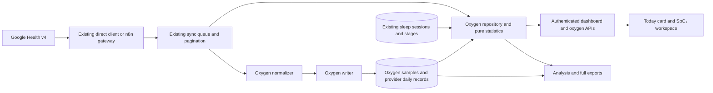

# SpO₂ tracker design

Date: 2026-09-07

Status: Research-backed proposal for review; implementation has not started.

Baseline inspected: `codex/owned-google-health-connector`, commit `c44fcc0`.

Companion: [Implementation plan](../plans/2026-09-07-spo2-tracker.md).

## 1. Intended result

Make blood oxygen a first-class Health Hub workspace: preserve Google's SpO₂ records, show the nightly picture beside sleep, distinguish measured values from provider statistics, and make the history exportable. A selected date answers:

- What average did Google report for this date?
- What individual readings are stored across the selected sleep session, including the previous evening?
- What were the observed sample range and sampling gaps?
- How do reported daily averages change over the last week, month, and year?
- Are readings absent, still being fetched, unavailable locally, or affected by a failed sync?

The requested work in this task is the spec and plan. No application code, database migrations, live synchronization, releases, or production gates were executed. The documents use defaults so Philippe does not need to answer questions overnight. They do not assert that the proposal has been approved for implementation.

## 2. Findings that affect the design

### Current upstream contract

Use Google Health v4. Google documents the legacy Fitbit Web API's shutdown for September 2026; the local application already has a Google OAuth connector and direct/n8n gateway selection. Adding a new legacy Fitbit integration would create a migration dependency immediately. [Google migration notice](https://developers.google.com/health/about).

Both `oxygen-saturation` and `daily-oxygen-saturation` support `list` and `reconcile` under `https://www.googleapis.com/auth/googlehealth.health_metrics_and_measurements.readonly`. The scope is already **requested by the checked-out code**; the actual connection's grant and SpO₂ availability have not been probed in this task. [Vitals data types](https://developers.google.com/health/data-types/vitals).

The important REST fields are:

| Record | Fields to retain | Meaning |
|---|---|---|
| `oxygenSaturation` | `sampleTime.physicalTime`, `sampleTime.utcOffset`, optional `sampleTime.civilTime`, `percentage` | Timestamped percentage, valid API range 0–100 |
| `dailyOxygenSaturation` | `date`, `averagePercentage`, `lowerBoundPercentage`, `upperBoundPercentage`, optional `standardDeviationPercentage` | Reported sleep average, confidence bounds, and variability of daily averages over the preceding 7–30 days |

The confidence bounds are **not sample minimum/maximum**. The optional standard deviation is **not within-night variability**. The reference does not give a confidence level; do not invent “95% confidence.” Observation timestamps include the event's UTC offset. [SpO₂ REST schema](https://developers.google.com/health/reference/rest/v4/users.dataTypes.dataPoints#OxygenSaturation), [daily schema](https://developers.google.com/health/reference/rest/v4/users.dataTypes.dataPoints#DailyOxygenSaturation).

Use URL-encoded `filter` parameters, not the bare `startTime`/`endTime` parameters shown in some introductory examples:

```text
GET /v4/users/me/dataTypes/oxygen-saturation/dataPoints
  filter=oxygen_saturation.sample_time.civil_time >= "2026-09-06"
     AND oxygen_saturation.sample_time.civil_time < "2026-09-08"

GET /v4/users/me/dataTypes/daily-oxygen-saturation/dataPoints
  filter=daily_oxygen_saturation.date >= "2026-09-07"
     AND daily_oxygen_saturation.date < "2026-09-08"
```

Hyphens belong in resource names; underscores belong in filters. [Filter rules](https://developers.google.com/health/filters). A list page can contain at most 10,000 records, and every `nextPageToken` must be followed with the original request parameters unchanged. A short or empty page with a token is not completion. [List reference](https://developers.google.com/health/reference/rest/v4/users.dataTypes.dataPoints/list).

### Product and measurement limits

Fitbit estimates SpO₂ during sleep. Device configuration, region, fit, movement, short sleep, and delayed device processing can affect availability. Sync does not make a device reconstruct nights it never recorded. The device help describes at least three hours of quality sleep and possible processing delay around an hour; these are troubleshooting guidance, not backend validation thresholds or a guaranteed API delivery time. The feature is for wellness. [Fitbit SpO₂ help](https://support.google.com/googlehealth/answer/14226120?hl=en).

The old Fitbit intraday API explicitly described a five-minute exponentially moving average and a main-sleep date that could include samples from the preceding evening. That is evidence against claiming raw optical measurements, exact desaturation events, or live monitoring. It does **not** establish Google v4's sample cadence or smoothing algorithm. Inspect actual v4 timestamps and retain whatever arrives. [Legacy intraday semantics](https://dev.fitbit.com/build/reference/web-api/intraday/get-spo2-intraday-by-date/).

Google lists Fitbit Air, several Charge/Inspire/Sense/Versa models, and Pixel Watch 2 and later among supported SpO₂ devices. The exact user's device and enabled tracking are still unverified; absence of API records alone cannot establish unsupported hardware. [Device compatibility](https://developers.google.com/health/data-types/device-compatibility).

Google's history guide describes access to recorded history with pagination. Our 90-day raw backfill limit is an application policy, not evidence that Google deletes older oxygen samples. The proposed 14/90-day chunk sizes below are application choices, not SpO₂ API limits. [Historical queries](https://developers.google.com/health/endpoints#query-historical-data). Preserve the existing bounded worker and transient retries; 429 responses require backoff. [Rate limits](https://developers.google.com/health/rate-limits).

## 3. What already exists locally

| Area | Existing implementation | SpO₂ implication |
|---|---|---|
| OAuth | `lib/connectors/google-oauth.js`, encrypted connector repository | Reuse tokens and consent; no new credential store |
| Transport | `google-health-request.js`, direct client, n8n gateway, `scripts/connector-support.mjs` | Extend both transport paths; direct mode can fall back to n8n |
| Sync | Persistent jobs/chunks, pagination, account claims, three-hour schedule, seven-day lookback | Add metric registrations and ingestion branches; preserve scheduling controls |
| Storage | PostgreSQL migrations, parameterized writers, retained source JSON | Add isolated oxygen tables and writer; reuse migration runner |
| Read model | `health-repository.js`, authenticated `health-routes.js` | Add dashboard projection and oxygen endpoints |
| UI | ES modules, DOM/SVG, Tailwind; Today, Sleep, Heart, Calories workspaces | Add `public/oxygen-ui.js`; keep `app.js` integration small |
| Exports | Analysis JSON/CSV, streamed full ZIP, fixed-layout PNG | Include oxygen explicitly in each selected output |
| Archive | Immutable R2 bundle v1 includes only heart and calorie raw records | Oxygen has no verified cold-storage representation today |
| Verification | `node --test`, pg-mem, opt-in isolated PostgreSQL tests, fixture preview | Extend these patterns; no new frontend framework or test runner |

The September 4 connector spec's R7 and implementation plan's Task 10 are historical starting points, superseded for SpO₂ by these documents. In particular, do not copy their `minimumPercentage`/`maximumPercentage` assumptions, exclusion of zero, default-to-UTC offset, or value-dependent fallback identity. Do not treat their workflow headers as authorization for agents or releases.

## 4. Alternatives and recommendation

| Approach | Benefit | Cost / limitation |
|---|---|---|
| Daily summaries only | Smallest addition; useful long-term trend | Cannot inspect overnight samples, actual minimum, or gaps |
| **Daily summaries plus preserved intraday records** | Supports the requested tracker and later analysis; fits the connector | Requires careful date association, source separation, and exports |
| Full oxygen event engine plus R2 archive v2 | Potential event analysis and indefinite cold storage | Adds unverified measurement assumptions and a separate archive migration |

Choose the middle approach. `list` preserves provider records and provenance. `reconcile` is available but combines sources and can change the representation; adopting it as the sole stored source would lose the very provenance this archive needs. It remains a possible future display adapter after an explicit comparison. [Reconcile contract](https://developers.google.com/health/reference/rest/v4/users.dataTypes.dataPoints/reconcile).

## 5. Scope and defaults

### Included in the first complete release

1. Both oxygen data types in normal sync and a metric-selective backfill command.
2. Idempotent PostgreSQL storage with provider fields preserved.
3. A Today card and dedicated SpO₂ workspace, plus a link from Sleep.
4. Night chart, observed statistics, sleep stage context, source selection, sampling gaps, and independent data/sync states.
5. Seven-, thirty-, and 365-day trends of provider daily averages, with missing dates visible.
6. Analysis/full exports and an oxygen section in PNG summaries.
7. Deterministic fixtures and focused regression tests, followed by one release verification cycle.

### Deferred deliberately

- Medical alerts, push/email notifications, sleep-apnea classification, ODI/AHI, diagnostic severity bands, and inferred seconds below a threshold.
- Recreating Fitbit's estimated oxygen variation graph or claiming access to PPG waveforms.
- Automated explanations of why a reading changed, causal correlations with journal tags, or new HRV/respiratory metrics.
- New devices, phone apps, manual oximeter entry, and an oxygen-specific OAuth flow.
- R2 format v2, compact oxygen tables, pruning, destructive reconciliation of absent provider records, and all historical raw backfill beyond the existing policy.

These exclusions do not make missing data disappear: the UI and export manifest must state the actual availability. Larger archive and event-analysis features need their own later designs.

## 6. Architecture and interfaces



New modules and their public boundaries:

```ts
// Contract notation only. Implement as the repository's existing JavaScript ES modules.
type Range = { startDate: string; endDateExclusive: string };
type OxygenSelection = { sampleSource?: string; dailySource?: string };
type OxygenSample = {
  providerKey: string; providerId: string; sourceKey: string;
  civilDate: string; sampledAt: string; utcOffsetSeconds: number;
  percentage: number; sourceMetadata: object; sourceFields: object;
};
type OxygenDaily = {
  providerKey: string; providerId: string; sourceKey: string; civilDate: string;
  averagePercentage: number; lowerBoundPercentage: number | null;
  upperBoundPercentage: number | null;
  standardDeviationPercentage: number | null;
  sourceMetadata: object; sourceFields: object; qualityFlags: string[];
};

// lib/metrics/oxygen-normalizer.js; whole-page validation before writes.
normalizeOxygenSaturationSamples(payload: object): OxygenSample[];
normalizeDailyOxygenSaturation(payload: object): OxygenDaily[];

// lib/metrics/oxygen-time.js; shared exact time parsing for normalization and selection.
oxygenInstantNanoseconds(timestamp: string): bigint;
parseOxygenTime(sampleTime: object): {
  sampledAt: string; civilDate: string; utcOffsetSeconds: number; epochNanoseconds: bigint;
};

// lib/db/oxygen-writer.js; delegate these methods from createMetricWriter.
createOxygenWriter(pool: object): {
  upsertOxygenSaturationSamples(accountId: string, rows: OxygenSample[]): Promise<void>;
  upsertDailyOxygenSaturation(accountId: string, rows: OxygenDaily[]): Promise<void>;
};

// lib/metrics/oxygen-statistics.js; no database or browser dependencies.
summarizeOxygenSamples(samples: OxygenSample[], window: {
  startTime: string; endTime: string;
}): OxygenSampleSummary;

// lib/db/oxygen-repository.js; account ID is resolved by authenticated server code.
createOxygenRepository(pool: object): {
  getDay(accountId: string, date: string, selection?: OxygenSelection): Promise<OxygenDay>;
  getRange(accountId: string, range: Range, selection?: OxygenSelection): Promise<OxygenRange>;
};
```

`OxygenSampleSummary`, `OxygenDay`, and `OxygenRange` are defined in sections 10–11. New files own the feature; no wholesale split of the existing application is needed.

## 7. Storage, identity, and normalization

Migration `008_oxygen_saturation.sql` is the next available number at the inspected commit. Recheck before implementation; never overwrite an intervening migration.

Two tables:

| Table | Columns beyond ID/account/audit timestamps | Constraints / indexes |
|---|---|---|
| `oxygen_saturation_samples` | `provider_key`, `provider_id`, `source_key`, `civil_date`, `sampled_at`, `sample_time_text`, `utc_offset_seconds`, `percentage`, `source_metadata`, `source_fields` | Unique `(source_account_id, provider_key)`; indexes `(source_account_id, sampled_at)` and `(source_account_id, civil_date, sampled_at)` |
| `oxygen_saturation_daily_summaries` | `provider_key`, `provider_id`, `source_key`, `civil_date`, `average_percentage`, nullable `lower_bound_percentage`, `upper_bound_percentage`, `standard_deviation_percentage`, `quality_flags`, `source_metadata`, `source_fields` | Unique `(source_account_id, provider_key)`; index `(source_account_id, civil_date, source_key)` |

Use `numeric` without a rounding scale for percentages and offset seconds; validate finite values in JavaScript and add database range checks. Samples and averages accept 0–100 inclusive. Non-null bounds accept 0–100 and must be ordered. Non-null standard deviation is nonnegative. JSON uses `jsonb`. `sample_time_text` retains the original timestamp; `sampled_at` is its indexed PostgreSQL projection. Raw exports use the original text rather than round-tripping it through JavaScript `Date`. Browser chart coordinates may use millisecond precision; they are not the archival timestamp representation.

Identity rules:

- For list responses, use the provider's nonempty `name` as both provider key and provider ID. Keys are scoped to the source account. UUIDs use `deterministicUuid` with separate namespaces for samples and daily records.
- Do not include percentage, local date, or formatted timestamp in the provider key. A corrected value or timestamp with the same provider name updates one record.
- Missing names are a contract error until an observed upstream representation establishes an alternative stable identifier. Do not guess aliases or a value-based hash.
- Compute `sourceKey = hashSourceMetadata(point.dataSource ?? {})` using the existing canonical hashing helper. This is a grouping key for reported metadata, not proof of physical device identity. Retain the complete metadata.
- Preserve different provider records even when their timestamp matches. Deduplicate identical repeated provider names; conflicting duplicates within one response page are a contract error rather than page-order selection.
- Daily records are not unique by date alone: `list` can return multiple sources. Avoid overwriting one source with whichever page happened to arrive last.

Validation rules:

- Accept `{ dataPoints: [...] }`; also accept `{}` as an empty protobuf response, or an omitted array with a valid continuation token. Reject `null`, arrays as the envelope, an `error` object, a non-array `dataPoints`, wrong metric records, and invalid token types. Unrecognized nonempty envelopes with neither recognized field are errors, not empty success.
- Require numeric finite percentages; do not coerce booleans, blank strings, or null to zero. Preserve an explicit zero, flag it for display, and never label it missing.
- Require a valid RFC 3339 physical timestamp and a valid explicit duration offset. Missing/invalid offset must not silently become UTC. Validate civil dates by calendar round-trip; February 30 is invalid. Preserve source JSON before presentation transformations.
- Derive sample civil date from physical time plus the sample's offset, not today's profile offset or the host timezone. If an explicit upstream civil time contradicts it, fail validation rather than changing dates silently.
- Require a valid daily date and average. If bounds are absent, store null and `bounds-missing`; a provider average is still useful. Reject supplied invalid bounds. Do not derive bounds from the raw chart or require the average to equal its midpoint.
- Validate the entire page before any writes. A malformed nonempty page fails that chunk with a sanitized nontransient contract error. Earlier committed pages remain stored; the range stays incomplete. Do not log offending values, provider IDs, payloads, or transport secrets. Re-running the range after fixing the parser is idempotent.

Both writers use page transactions, parameterized SQL, upserts, rollback, and `finally` release. They do not call the compact writer or delete absent records. This is an archive of observations: upstream deletion mirroring is outside this release. Re-fetching an empty range never erases previously stored data.

## 8. Sync and data availability

Register both types in `GOOGLE_HEALTH_METRICS` and `DEFAULT_SYNC_METRICS`; only intraday oxygen joins `RAW_SYNC_METRICS`. Both use `list`. Choose 14-day sample chunks and 90-day daily chunks, with the existing 10,000 page size and newest-first planning.

Preserve the configured schedule and recent lookback. Expand only the oxygen sample fetch start by one civil day to cover the previous evening of the earliest requested sleep date. Apply this expansion before chunking, then clamp it to the configured raw cutoff. Never expand the end date. A custom request whose *requested* start violates the raw cutoff still returns 400. Expansion does not authorize crossing that cutoff. If the cutoff truncates a sleep session, expose incomplete fetch coverage rather than manufacturing the preceding samples. Historical daily summaries remain eligible from membership start.

Add `--metrics=oxygen-saturation,daily-oxygen-saturation` to `scripts/sync-backfill.mjs`; preserve its existing two-date invocation as the default. The flag must validate and deduplicate allowed metrics, reject unknown/empty values, and pass the subset to `enqueue`. The first canary uses a bounded recent window. A later daily-only backfill can reach membership start without re-fetching heart/calorie history.

Both the direct request builder and the generated n8n gateway need the same oxygen allow-list and filters. Do not assume `GOOGLE_CONNECTOR_MODE=direct` makes n8n unreachable: local runtime explicitly falls back when the direct client is unavailable. Importing/releasing a generated workflow is a separate live operation. Existing workflow identities and credentials stay intact.

Reuse the transport error policy: bounded retries for 429, 5xx and transport failures; terminal chunk errors for 400/403 or malformed data. A 403 is a permission/provider problem, not an empty night. An oxygen error must not strand successful sleep/heart/calorie daily summary finalization. At terminal job completion, allow the existing daily recalculation when all requested **non-oxygen** chunks completed even if oxygen failed; preserve the old failure behavior when a non-oxygen metric itself failed. Cover both terminal paths: the last chunk succeeds through `completeChunk`, or the last chunk fails through `failChunk`. The latter currently has no finalization callback and needs a narrow extension. Oxygen-only jobs do not recalculate unrelated summaries. Keep the job's `completed_with_errors` status visible.

Read availability from existing `sync_jobs`/`sync_chunks`; no extra scheduler or status table:

- Group chunks by job, metric, start, and end. A window is successful only after every page in its chain completed and the final continuation ended.
- Union successful windows to decide whether the requested civil range has been fetched completely. A single completed page never proves range completeness.
- Return the latest relevant attempt separately from the latest successful covering fetch. Queued/running/failed retries must not hide existing measurements.
- Derive “no readings returned” only when a covering fetch completed and no retained records exist. Otherwise use “not fetched completely” or the current fetch failure.
- Global connection freshness is not oxygen freshness. Oxygen responses expose their own last sample time and last successful sample/daily fetches. Daily dates never become invented UTC measurement instants.

## 9. Sleep attribution and sources

The selected date follows the Sleep workspace's date convention. Select the longest non-nap sleep session on that date, as the current repository does; add a stable ID tie-breaker to the oxygen query. Fetch samples by that session's physical `[start_time, end_time)` interval, not `sample.civil_date = selectedDate`. This includes pre-midnight readings and works across DST. Show the actual start/end and offsets. Do not assume the provider daily summary covers precisely that local session; label it “Google daily summary” alongside “Selected sleep session.”

The daily provider date remains authoritative for trends and is never rewritten. The samples' civil dates are retained independently. Session association is computed on read so later sleep corrections immediately change the plotted window without rewriting samples.

When no non-nap sleep is stored, show the provider daily summary if available. Show samples for the selected recorded civil date in a clearly titled “Calendar-day samples — sleep session unavailable” fallback; do not invent an 18:00–noon night. No sleep stages or sleep coverage ratio are shown there. An optional `sessionId` is deferred; links from Sleep select its existing primary session.

Keep sources separate:

- One intraday metadata group: select it automatically. More than one: show a source chooser and no combined curve/statistics until one is selected.
- For a selected daily metadata group/date, exactly one provider record yields the reported summary. Multiple distinct records in that group/date are an ambiguity state; never average confidence intervals or select by arrival order. Display the candidates in a small table.
- Daily and sample source selections are independent; daily derivations may have metadata different from the originating device. Do not require their hashes to match or assert they are identical devices.
- Different names at the same exact original sample timestamp within the selected group: if percentages agree, use one observation for derived statistics and report duplicate count. If they disagree, preserve both, flag a conflict, exclude that timestamp from the connected curve and statistics, and show both in the reading table. Never average contradictory readings.
- Unknown source metadata is labeled “Source not identified.” Escape provider-supplied labels before inserting them in HTML/SVG.

## 10. Statistics and rendering rules

`OxygenSampleSummary` contains `sampleCount`, `duplicateCount`, `conflictCount`, `averagePercentage`, `minimumPercentage`, `maximumPercentage`, `medianPercentage`, `firstSampleAt`, `lastSampleAt`, `observedMinuteCount`, `sleepWindowMinuteCount`, `observedMinuteFraction`, `gapCount`, `longestGapSeconds`, and `qualityFlags`. Nullable statistics are null when there are no usable observations. Counts can be zero. `sleepWindowMinuteCount` and `observedMinuteFraction` are null without a sleep session.

- Observed min/max/median/arithmetic mean use the selected, deduplicated samples only. They are explicitly sample statistics, not substitutes for Google's average.
- A minute is observed when at least one usable sample falls in it. Count UTC minute buckets intersecting the selected physical window; denominator is the number of minute buckets intersecting that window. Label the ratio “minutes containing a reading,” never continuous sensor coverage or a clinical confidence score. Do not use the heart writer's 20-hour completeness rule.
- A gap is an interior interval between adjacent usable samples greater than 120 seconds. Report boundary gaps separately in the chart/window context; do not count hours before/after sleep. The 120-second cutoff is a versioned chart-display choice, not an upstream cadence claim. A conflicting timestamp always breaks a line.
- Draw measured points with straight segments only across gaps at or below that limit. No smoothing, interpolation, upsampling, or synthetic readings. Preserve isolated points. Align a separate sleep-stage lane to the same physical time axis; no inferred physiological relationship.
- Render all normal nightly points; above 1,200 points, use chronological buckets retaining first/min/max/last observations per bucket. Split on gaps/conflicts **before** reducing. Statistics still use the full dataset. A notice identifies a reduced visual representation, and exports retain all provider rows.
- Default axis 85–100% for readability, expanding downward to the next five-point tick for any lower reading or bound, including zero. Never clip low values or color zones “healthy/dangerous.” Axis ticks are always visible. One decimal in cards; full retained precision in exports.
- The daily trend line and confidence band use only unambiguous provider summaries, with blank dates producing visible breaks. Period average is the equal-weight mean of available daily averages; show `daysWithSummary / requestedDays`. Do not weight by intraday sample count or substitute sample averages on missing-summary days.
- Optional provider standard deviation appears only in the detail table with its actual historical meaning. The first version does not compute or interpret an oxygen desaturation index.

## 11. API and UI contracts

All reads use existing session auth and `no-store`; no browser calls Google. Resolve the source account on the server. Reject invalid calendar dates, inverted ranges, unknown resolutions, invalid source keys, and ranges longer than 366 days with 400. Raw detail is one selected date/session only. Use indexed bounded queries; cap a single detail request at 50,000 fetched rows with an explicit 413 and an export link, never silent truncation.

### API

```text
GET /api/dashboard?date=2026-09-07
  Adds oxygenSaturation: a compact projection of OxygenDay without raw samples/stages.

GET /api/metrics/oxygen?start=2026-09-01&end=2026-09-08&resolution=day
  Returns OxygenRange. Optional dailySource=<64-character hex metadata hash>.

GET /api/metrics/oxygen?start=2026-09-07&end=2026-09-08&resolution=night
  Returns OxygenDay. Optional sampleSource=... and dailySource=....
```

`OxygenDay` fields: `date`, `timezone`, `dataState`, `dailySummary`, `dailyCandidates`, `sampleSummary`, `samples`, `plot`, `sampleSources`, `dailySources`, `selectedSampleSource`, `selectedDailySource`, `sleepSession`, `window`, `availability`, `sync`, `newestSampleAt`, `qualityFlags`.

`dailySummary` is null or the selected provider daily fields from `OxygenDaily` with internal `sourceFields` omitted. Public `samples` contain `sampledAt`, `utcOffsetSeconds`, `percentage`, and conflict/duplicate flags, never full source JSON. `plot` contains server-computed `segments` (arrays of the same public sample shape), `reduced`, and `gapSeconds: 120`; the frontend renders these instead of implementing a second reduction/statistics algorithm. `sleepSession` contains ID, physical bounds, source offsets, and stages, or null. `window` contains `kind: 'sleep-session' | 'civil-day'`, start/end when physical bounds exist, and the recorded civil range actually requested.

`dataState` is `ready` (summary and usable selected samples), `summary-only`, `samples-only`, `empty`, `not-synced`, or `source-selection-required`. Data state never encodes connection health. `availability` contains `raw: 'local' | 'partial-local' | 'unavailable'`, `coldArchiveSupported: false`, `fetchComplete`, and the requested/fetched ranges. “Local” describes stored rows, not complete sensor capture. `sync` contains independent intraday/daily `lastAttemptStatus`, `lastAttemptAt`, `lastSuccessfulFetchAt`, `fetchComplete`, and a safe `errorCode`; `newestSampleAt` remains separate.

`OxygenRange` fields: `startDate`, `endDateExclusive`, `timezone`, `days`, `dailySources`, `selectedDailySource`, `periodSummary`, and `sync`. Each `days` entry contains `date`, `dailySummary`, `dailyCandidates`, and `dataState`, with null summaries for absent/ambiguous records. `periodSummary` contains `averageDailyPercentage`, `daysWithSummary`, `requestedDays`, and `missingDays`. Range reads use daily records and sync metadata only, never a year's intraday rows.

### UI

- Navigation label **SpO₂**, accessible name **Blood oxygen**; hash route `/#oxygen`.
- Today card headline: reported average, `%`, and explicit selected date. Secondary provider confidence interval. If daily summary is absent but samples exist, label their mean “Sample average” rather than “Google average.” Clicking opens that date's workspace.
- Workspace order: local date controls; daily average/confidence interval; observed sample min/median/max and count; overnight chart; sleep-stage lane; sampling/data-quality details; compact reading table; trend controls.
- Tabs **Night / 7 days / 30 days / Year**. Reuse the existing range math (1/7/30/365 days); keep date controls accessible within the workspace. Trend point selection drills into that date. Keep selected date/source/range in application state across sync refreshes.
- Offer links to Sleep and Journal on the same date. Do not fetch/decrypt journal text for an oxygen chart automatically.
- A 200 empty response says “No SpO₂ readings returned for this period.” Before a complete fetch: “SpO₂ has not been fetched completely for this period.” With a summary but no points: “Daily summary available; individual readings are not stored locally.” With failed fetch: retain the chart and show “SpO₂ sync failed” plus the existing reconnect/retry route when applicable.
- A short help disclosure explains sleep/device processing and links to the upstream device guide. One concise wellness note: “Wearable estimates for personal tracking; not a medical monitor.” No diagnostic scoring, red emergency banners, or fabricated reassurance.
- Loading, empty, partial, error, multi-source, zero, and stale states must work at 375px and 1440px. Chart has a text summary and keyboard-accessible reading table. Hover values also work by focus/tap. Failed or out-of-order requests must not replace a newer selected date's view.

## 12. Exports and retention

Add public metric selector `oxygen`. Use export schema `1.1.0` for newly generated exports; preserve old ZIP readability and existing columns, adding oxygen data. Include `oxygen-saturation-daily.csv` for every oxygen export and `oxygen-saturation-samples.csv` for full exports. Analysis JSON includes selected provider daily records and their ambiguity/availability metadata. Every full export preserves all sources, duplicates, conflicts, original timestamp text, offsets, provider identity, and original source fields.

Raw export date semantics are **sample civil dates** in `[start, end)`, consistent with existing raw files. Daily oxygen export dates are provider dates. A one-day raw export can therefore exclude the previous evening visible in the night's chart. Explain this in the manifest and offer a two-day default range when exporting from a night. Do not silently redefine other raw exports' date semantics.

Add normalized fields to `daily-summary.csv`: `oxygen_average_percentage`, `oxygen_lower_bound_percentage`, `oxygen_upper_bound_percentage`, and `oxygen_summary_state`. These are provider statistics or null, never raw extrema. Preserve each original provider daily record in the oxygen-specific CSV even when the joined day is ambiguous. Add definitions, percent units, source rules, and precise coverage to the manifest. Journal export remains explicitly opt-in.

PNG: add a compact blood-oxygen panel and daily average column for selected oxygen exports, with decimal formatting and days measured. A four-metric panel layout and bounded recent rows must fit the existing 1600×1000 canvas; render and inspect it. If an output cannot represent a requested oxygen metric, reject it explicitly rather than silently omitting it.

Keep every existing compact-write, archive-execution, pruning, read-cutover, table-removal, and PostgreSQL tuning gate disabled unless Philippe explicitly approves the specific gate. Additive oxygen tables are ordinary retained PostgreSQL data. `RAW_RETENTION_DAYS` limits fetch eligibility; it does not delete stored samples or make a night disappear at day 91.

Do not attach oxygen to existing R2 catalog entries: those entries verify only their declared heart/calorie schemas. Export availability must report oxygen local counts/ranges and `coldArchiveSupported: false` independently. Existing database backup coverage must be checked during a later release; this spec does not claim that an R2 archive or tested restore currently protects oxygen. Estimate storage after the canary from `pg_total_relation_size` divided by imported sample count before approving a larger raw backfill.

## 13. Validation and release sequence

The [implementation plan](../plans/2026-09-07-spo2-tracker.md) carries the runnable task sequence. Acceptance criteria:

| ID | Required observable result |
|---|---|
| A1 | Correct Google filter fields and operation parity in direct and generated n8n paths |
| A2 | Decimal precision, zero versus null, strict date/offset validation, source JSON preservation |
| A3 | Repeated pages and corrected values/timestamps update stable identities without duplicating records |
| A4 | Bounds never become min/max; historical SD never becomes nightly variability |
| A5 | A night crossing midnight/DST includes the correct samples and excludes the end-boundary sample |
| A6 | Multiple sources/conflicts are preserved and cannot silently blend into a chart |
| A7 | Empty, unfetched, in-progress, partial-page, 403, and disconnected states remain distinguishable |
| A8 | Oxygen failure cannot prevent successful pre-existing metrics from finalizing |
| A9 | Observed statistics and gaps are computed from actual samples; trends preserve missing dates |
| A10 | Today, Sleep link, source/date controls, and accessible mobile/desktop rendering work |
| A11 | Analysis, full CSV/JSON, PNG, and coverage manifest include requested oxygen data faithfully |
| A12 | Raw cutoff is respected, stored history is retained, and no existing archive gate or catalog is repurposed |

Future execution order: synthetic contract fixtures → additive storage → sync integration → read model → UI → exports → release checks → bounded live canary → daily historical backfill. No live probe is required to finish this specification. Before releasing ingestion, obtain a sanitized structural fixture through the existing connector for both endpoints; no personal readings or credential material belong in Git. If only daily data is available, the complete feature must still operate in summary-only mode. Do not promise live intraday support for this account until observed.

Use the smallest relevant tests while implementing. Before release, run one `npm test`, one `npm run build`, generated-workflow reproducibility check, and `git diff --check`. Run real PostgreSQL cases against the existing isolated test-schema harness; a skipped integration suite is reported as skipped. Fixture UI and generated PNG require visual inspection. Do not execute production migrations or backfill as part of planning.

Rollback after a future release: return to the previous app image and leave additive tables/data intact. Pause only the new oxygen fetches if necessary; do not delete stored rows, revert a production database, or alter unrelated metric history.

## 14. Decisions for Philippe when awake

No answer was needed to finish this draft. Proposed defaults are recorded, not inferred approval:

| Question | Default used here | Consequence of another answer |
|---|---|---|
| Which device currently supplies the oxygen data? | Discover through a bounded connector probe; do not assume the older doc's Fitbit Air reference identifies the device | Changes setup help and expected availability, not the basic tables |
| Full workspace or only a card under Sleep? | Full SpO₂ workspace with Today/Sleep entry points | Card-only can omit much of the UI task while retaining ingestion |
| Should thresholds/alerts be part of v1? | No; factual history, measured samples, and trends | Requires a separate specification of measurement limitations and notification behavior |
| How much historical raw data? | Existing configured fetch clamp; full available daily history | Increasing the raw range requires an explicit policy decision and storage estimate |
| Does lifelong R2 archival need to ship simultaneously? | Separate follow-up; retain oxygen in PostgreSQL and export it | Requires archive format/version/restore work before any oxygen pruning can be considered |

## 15. Remaining empirical checks

These are concrete verification tasks, not missing design sections: actual consent grant; current live deployment/connector mode; both endpoints' observed shape; whether the current device has daily and intraday history; sample cadence and source metadata; provider daily date versus locally selected main sleep; sample volume and database backup inclusion. None was assumed from production or obtained by reading secrets. The plan assigns these to a bounded read-only probe and pre-release validation.
